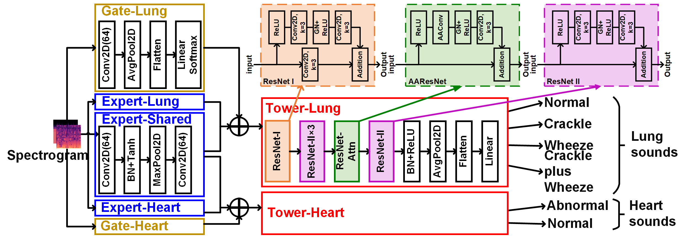
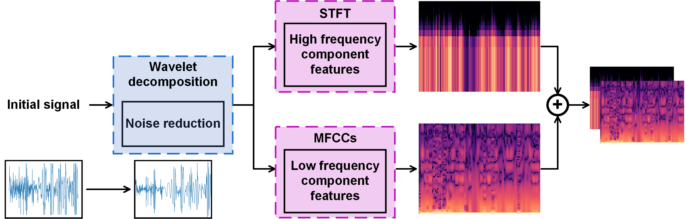
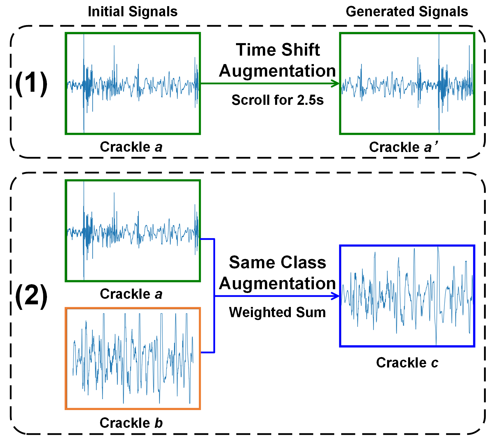
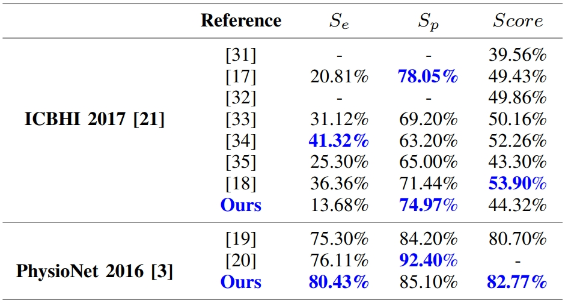
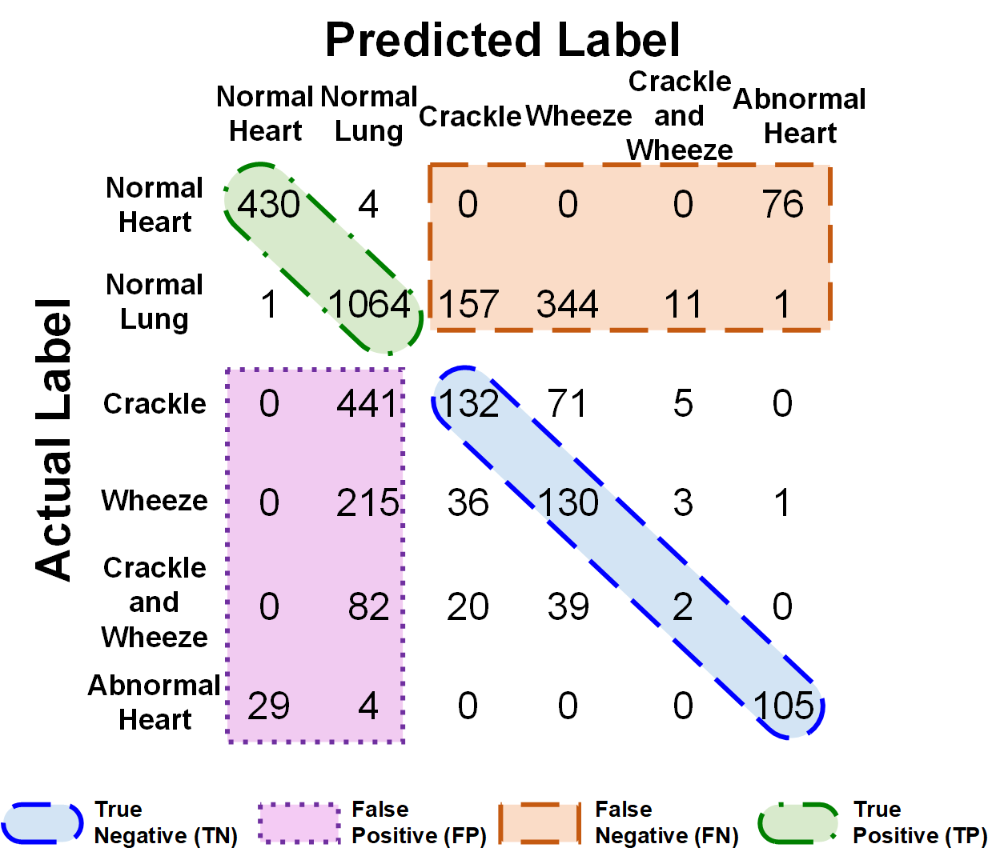

# LungHeart-AtMe

This repository contains the LungHeart-AtMe for lung sound and heart sound deep learning classification model, published in [this paper](https://ieeexplore.ieee.org/document/10168624).

<!-- TABLE OF CONTENTS -->

## Table of Contents

* [LungHeart-AtMe](#LungHeart-AtMe)
  * [Pre-processing](#Pre-processing)
  * [Augmentation](#Augmentation)
  * [Train](#Train)
  * [Performance](#Performance)
* [Author](#Author)
* [License](#License)

## LungHeart-AtMe

The architecture of our LungHeart-AtMe model. The input is a 3-channel spectrogram after Short Time Fourier Transform (STFT) and extracting Mel-Frequency Cepstral Coefficients (MFCCs).



## Pre-processing

In order to train the model, you need to download the [ICBHI 2017](https://bhichallenge.med.auth.gr/) and [PhysioNet 2016]([Classification of Normal/Abnormal Heart Sound Recordings: the PhysioNet/Computing in Cardiology Challenge 2016](https://archive.physionet.org/challenge/2016/)) dataset. Each sample provided by the ICBHI 2017 dataset contains several breath cycles, so you need to clip them according to the start and end time declared officially. Then you need to divide the lung sound and heart sound segments into train set and test set. Here we divide them based on official suggestion.

The classes to clip samples, divide datasets, and move wave files to corresponding directories are concluded in
```
LungHeart-AtMe/Scripts/Dataset.py
```
named `clip_cycle`, `moveFileOfficial`, and `moveFileClasses` respectively.

After that, we implement wavelet denoising, Short Time Fourier Transform (STFT), and Mel-Frequency Cepstral Coefficients (MFCCs) extraction to convert the audio into spectrograms. 



You can run

```
LungHeart-AtMe/Scripts/Dataset.py
```
to store the spectrograms as pictures locally and save the spectrograms along with corresponding labels into `.p` file.
## Augmentation

To eliminate the imbalanced problem of the ICBHI 2017 and the PhysioNet 2016 dataset, we implement (i) Time Shift and (ii) Same Class data augmentation method. 


The implementation of the data augmentation methods is included in 
```
LungHeart-AtMe/Scripts/Dataset.py
```
named `wd_stft_mfcc_merge`.

## Train

The model was built using PyTorch, please read detail in 
```
LungHeart-AtMe/Scripts/Train.py
```
To modify the arguments used in the training process, please check the following script:

```
LungHeart-AtMe/Scripts/Args.py
```

To run the model, you can use the command

```
python3 Scripts/Train.py
```

## Performance

Comparison with state-of-the art works:



Confusion matrix:



## Authors

* **Changyan Chen** 
* **Qing Zhang**
* **Shirui Sheng** 
* **Huajie Huang**
* **Yuhang Zhang**
* **Yongfu Li***

## License

Please cite these papers if you have used part of this work.
```
C. Chen†, Q. Zhang, S. Sheng, et al. "LungHeart-AtMe: Adventitious Cardiopulmonary Sounds Classification Using MMoE with STFT and MFCCs Spectrograms," 2023 IEEE 5th International Conference on Artificial Intelligence Circuits and Systems (AICAS), 2023, pp. 1-5.
```